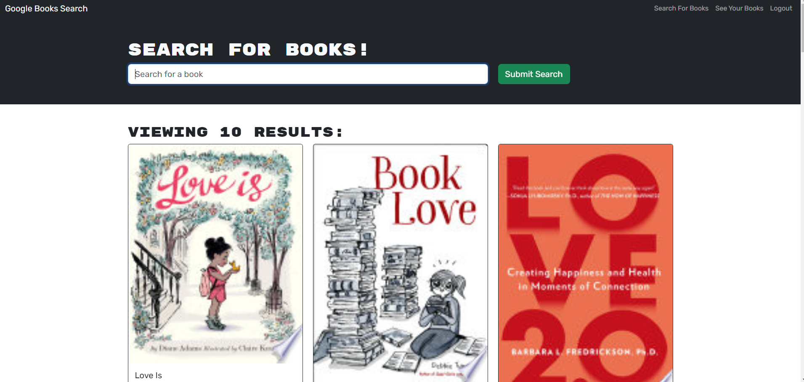

# Book collection

## Description
This is a web app that allow you to search for a book title from Google API and allow you to save books to your collection so that you can have easy access to them anytime. 

## Table of Contents
- [Installation](#installation)
- [Usage](#usage)
- [License](#license)
- [Contributing](#contributing)
- [Tests](#tests)
- [Questions](#questions)

## Installation
N/A

## Usage
You can visit our live site right here: https://book-collection-6q9c.onrender.com/

## Contributing 
N/A

## Tests
N/A

## Questions
If you have any questions and need to contact me, feel free to reach out at lehonguyen00@gmail.com. 
Or visit my [Github](https://github.com/honguyen00) for more information.
